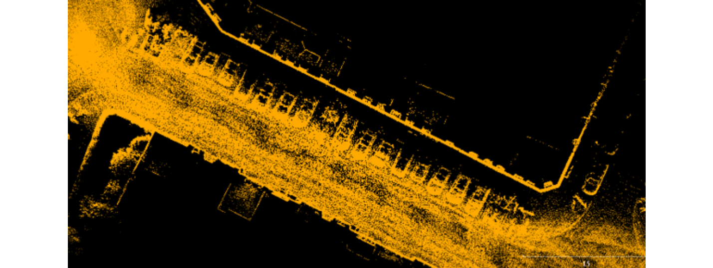
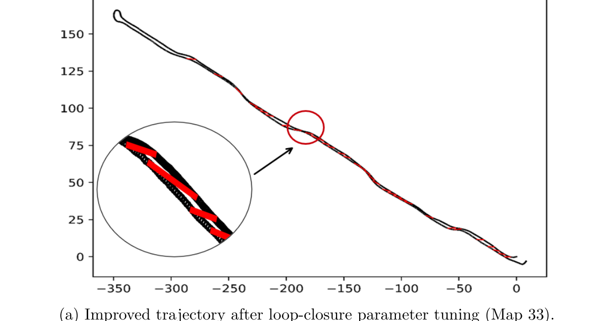
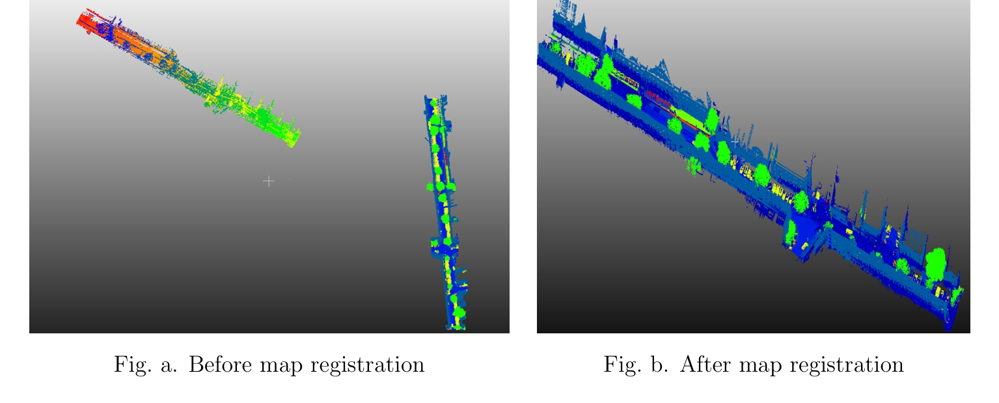
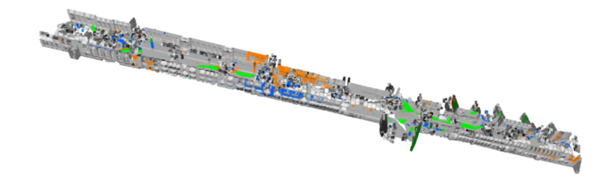
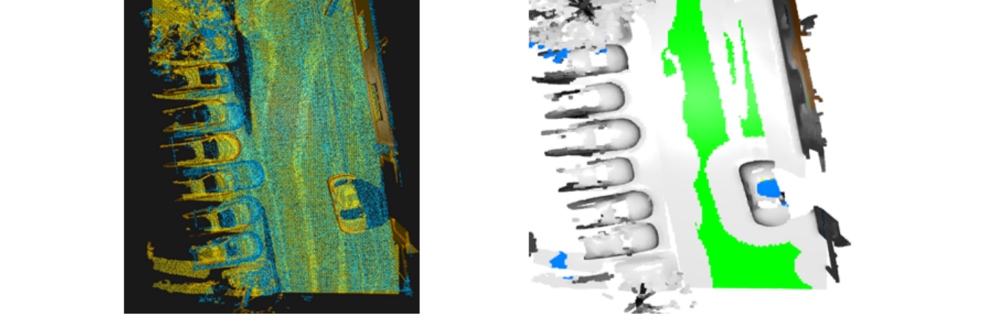
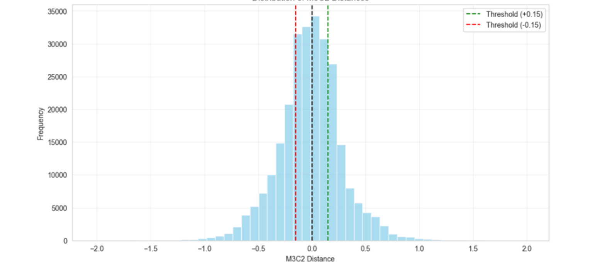

# LiDAR SLAM Mapping, Registration & Change Detection

SLAM-based 3D mapping and multi-temporal change detection on real urban mobile LiDAR data, captured with the IKG Mobile Mapping Cargo E-Bike in Hannover-Nordstadt, Germany. The map was generated with KISS-SLAM, registered against an independent high-precision reference dataset (Riegl VMX-250, 2017), and analysed for structural changes using M3C2.

*Dense 3D point cloud of an urban street corridor, reconstructed from mobile LiDAR scans using optimised KISS-SLAM poses.*

This was a group project seminar at the Institute of Cartography and Geoinformatics (IKG), Leibniz University Hannover. My primary contributions were the **point cloud registration** (RANSAC global alignment + ICP refinement) and the **M3C2 change detection** pipeline, with additional contributions to SLAM parameter tuning and evaluation.

## Key results

- Registration accuracy: **6.67 cm total RMSE** against an independent ground-truth reference map (X: 5.59 cm, Y: 3.51 cm, Z: 0.96 cm)
- SLAM parameter tuning increased detected loop closures from **0 to 33**, eliminating major trajectory drift
- M3C2 change detection processed **264,421 core points** across the full survey corridor
- Classification breakdown: 89.2% no significant change, 4.1% added, 3.2% removed, 3.4% unchanged-but-detectable
- Validated example: a parked vehicle correctly flagged as "Removed" between epochs, confirmed by visual inspection

## Pipeline overview

1. **Data acquisition** — Ouster OS1-128 mobile LiDAR mounted on a cargo e-bike, two trajectories (short and long track) recorded in an urban street environment
2. **SLAM mapping** — KISS-SLAM (LiDAR-only odometry + loop closure + pose graph optimisation), tuned for voxel resolution and loop closure thresholds
3. **Registration** — coarse global alignment via RANSAC on FPFH features, refined with point-to-point and point-to-plane ICP, evaluated using fitness score and inlier RMSE
4. **Change detection** — M3C2 (Multiscale Model-to-Model Cloud Comparison): multi-scale normal estimation, cylindrical neighbourhood projection, signed distance computation with a 95% confidence-based Level of Detection, and threshold-based classification into Added / Removed / Unchanged / No significant change

## Figures

*SLAM trajectory after loop-closure parameter tuning: 33 loop closures detected, eliminating the drift seen in the default configuration.*

*Point cloud alignment before and after RANSAC + ICP registration against the independent reference map.*

*M3C2 classified change map across the survey corridor. Orange: added, blue: removed, green: unchanged, grey: no significant change.*

*Validated example: a parked vehicle correctly detected as removed between the two epochs (left: raw overlay, right: classified result).*

*Distribution of M3C2 signed distances across all core points, approximately Gaussian and centred near zero, consistent with minimal global registration bias.*

## Methods and tools

Python, Open3D, NumPy, pandas, scikit-learn, matplotlib. KISS-SLAM (Guadagnino et al., 2025) for LiDAR-only SLAM. RANSAC global registration on FPFH features, point-to-point and point-to-plane ICP refinement. M3C2 (Lague et al., 2013) for uncertainty-aware change detection. Processing carried out on the LUIS HPC cluster (Leibniz University Hannover).

## Repository contents

- `scripts/dense_map_generation.py` — transforms individual LiDAR scans into a global dense map using KISS-SLAM pose estimates
- `scripts/rmse_evaluation.py` — RMSE and axis-wise deviation analysis between the SLAM map and the reference dataset
- `scripts/registration_ransac_icp.py` — full registration pipeline: preprocessing, FPFH feature computation, RANSAC global alignment, ICP refinement
- `scripts/m3c2_change_detection.py` — M3C2 change detection: core point selection, multi-scale normal estimation, distance computation, classification, and result visualisation

## Reference

Guadagnino, T., Mersch, B., Gupta, S., Vizzo, I., Grisetti, G., Stachniss, C. (2025). *KISS-SLAM: A Simple, Robust, and Accurate 3D LiDAR SLAM System With Enhanced Generalization Capabilities.* arXiv:2503.12660.

Lague, D., Brodu, N., Leroux, J. (2013). *Accurate 3D comparison of complex topography.* ISPRS Journal of Photogrammetry and Remote Sensing, 82, 10-26.

